# Week 1

## Index

- [Introduction](#Introduction)
- [Substitution Cipher](#Substitution-Cipher)
    - [Limitations](#Limitations)
- [Simple Substitution Cipher](#Simple-Substitution-Cipher)   
    - [Process of Simple Substitution Cipher](#Process-of-Simple-Substitution-Cipher)
    - [Limitations](#Limitations)
- [Polyalphabetic Cipher](#Polyalphabetic-Cipher)
    - [Limitations](#Limitations)
    - [Playfair Cipher](#Playfair-Cipher)
        - [Process of Playfair Cipher](#Process-of-Playfair-Cipher)
        - [Decryption](#Decryption)
        - [Security Value](#Security-Value)
    - [Vigenere Cipher](#Vigenere-Cipher)
        - [Process of Vigenere Cipher](#Process-of-Vigenere-Cipher)
        - [Decryption](#Decryption)
        - [Security Value](#Security-Value)
- [Pseudo-Random Number Generators](#Pseudo-Random-Number-Generators)
   - [Limitations](#Limitations)
   - [Advantages](#Advantages)
- [One-Time Pad Cipher](#One-Time-Pad-Cipher)              
   - [Advantages](#Advantages)
- [Transposition Cipher](#Transposition-Cipher)
   - [Rail Fence Cipher](#Rail-Fence-Cipher)
   - [Route Cipher](#Route-Cipher)
   - [Columnar Transposition](#Columnar-Transposition)
   - [Double Transposition](#Double-Transposition)    
   - [Myszkowski Transposition](#Myszkowski-Transposition)
- [Polybius Square](#Polybius-Square)
   - [ADFGVX Cipher](#ADFGVX-Cipher)
   - [Bifid Cipher](#Bifid-cipher)
   - [Nihilist Cipher](#Nihilist-cipher)
   - [Tap Code](#Tap-code)
   - [Trifid Cipher](#Trifid-Cipher)
- [Difference between Ciphers and Codes](#Difference-between-Ciphers-and-Codes)   

## Introduction

Two people Alice and Bob who share an important secret have to split up. This requires them to communicate private information from a distance. However, an eavesdropper named Eve also wants this information, and has the ability to intercept their messages.

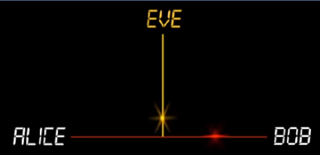

Alice decides to communicate using letters written in some kind of secret code.

`Encryption`: Alice locks her message in a box, using a lock that only she and Bob know the combination to.

`Decryption`: When Bob receives the box, he opens it using the code they shared in advance.

Cryptography begins when we abandon physical locks and use 'ciphers' instead. Ciphers allow Alice and Bob to scramble and descramble their messages so that they would appear meaningless if Eve intercepted them. The fascinating story of cryptography requires us to understand two very old ideas related to [Number Theory](https://en.wikipedia.org/wiki/Number_theory) and [Probability Theory](https://en.wikipedia.org/wiki/Probability_theory).

## Substitution Cipher ([Caesar Cipher](https://en.wikipedia.org/wiki/Caesar_cipher)) -

Caesar shifted each letter in his military commands in order to make them appear meaningless should the enemy intercept it. <br>
For example, Alice and Bob decided to communicate using the Caesar Cipher,  they would need to agree in advance on a shift to use-- say, three.


So to encrypt her message, Alice would need to apply a shift of three to each letter in her original message. So A becomes D, B becomes E, C becomes F, and so on.


This unreadable, or encrypted message, is then sent to Bob openly. Then Bob simply subtracts the shift of three from each letter in order to read the original message.

### Limitations

The weakness of the Caesar Cipher was published 800 years later by an Arab mathematician named Al-Kindi. He broke the Caesar Cipher by using a clue based on an important property of the language a message is written in. If you scan text from any book and count the frequency of each letter, you will find a fairly consistent pattern. For example, these are the letter frequencies of English. This can be thought of as a `Fingerprint of English`.


To break this cipher, they count up the frequencies of each letter in the encrypted text and check how far the fingerprint has shifted.

For example, if H is the most popular letter in the encrypted message instead of E, then the shift was likely three. So they reverse the shift in order to reveal the original message. This is called frequency analysis, and it was a blow to the security of the Caesar cipher.

## Simple Substitution Cipher

It is an improvement to the Caesar Cipher. Instead of shifting the alphabets by some number, this scheme uses some permutation of the letters in alphabet.

For example, A.B…..Y.Z and Z.Y……B.A are two obvious permutation of all the letters in alphabet. Permutation is nothing but a jumbled up set of alphabets. With 26 letters in alphabet, the possible permutations are 26! Factorial of 26 which is equal to 4x1026.

The sender and the receiver may choose any one of these possible permutation as a cipher text alphabet. This permutation is the secret key of the scheme.

### Process of Simple Substitution Cipher

- Write the alphabets A, B, C,...,Z in the natural order. The sender and the receiver decide on a randomly selected permutation of the letters of the alphabet.
- Underneath the natural order alphabets, write out the chosen permutation of the letters of the alphabet. For encryption, sender replaces each plaintext letters by substituting the permutation letter that is directly beneath it in the table.
- This process is shown in the following illustration. In this example, the chosen permutation is K,D, G, ..., O. The plaintext ‘point’ is encrypted to ‘MJBXZ’. Here is a jumbled cipher text alphabet, where the order of the cipher text letters is a key.

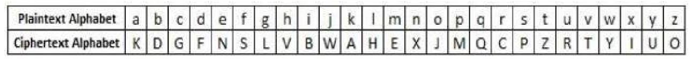

On receiving the cipher text, the receiver, who also knows the randomly chosen permutation, replaces each cipher text letter on the bottom row with the corresponding plaintext letter in the top row. The cipher text ‘MJBXZ’ is decrypted to ‘point’.

### Limitations

Simple Substitution Cipher is a considerable improvement over the Caesar Cipher. The possible number of keys is 26 and even the modern computing systems are not yet powerful enough to comfortably launch a brute force attack to break the system. However, the Simple Substitution Cipher has a simple design and it is prone to design flaws, say choosing obvious permutation, this cryptosystem can be easily broken.

##  [Polyalphabetic Cipher](https://en.wikipedia.org/wiki/Polyalphabetic_cipher) -

A strong cipher is one which disguises your fingerprint. To make a lighter fingerprint is to flatten this distribution of letter frequencies. Polyalphabetic ciphers aims to accomplish this.

For example, Alice and Bob shared a secret shift word (known as a ***Key***).  

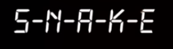

First, Alice converts the word into numbers according to the letter position in the alphabet.

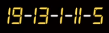

Next, this sequence of numbers is repeated along the message. Then each letter in the message is encrypted by shifting according to the number below it. Now she is using multiple shifts instead of a single shift across the message, as Caesar had done before.

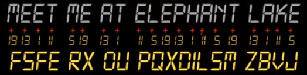

Now, A code breaker, Eve, who intercepts this series of messages and calculates the letter frequencies. She will find a flatter distribution, or a lighter fingerprint.

### Limitations

Code Breakers look for information leak, the same as finding a partial fingerprint. Any time there is a differential in letter frequencies, a leak of information occurs. This difference is caused by repetition in the encrypted message. <br>
In this case, Alice's cipher contains a repeating code word. To break the encryption, Even would first need to determine the length of this shift word used, not the word itself. She will need to go through and check the frequency distribution of different intervals. When she checks the frequency distribution of every fifth letter, the fingerprint will reveal itself.

The problem now is to break `Five Caesar Ciphers` in a repeating sequence. The longer the shift word, the stronger the cipher.


## [Playfair Cipher](https://en.wikipedia.org/wiki/Playfair_cipher)

In this scheme, pairs of letters are encrypted, instead of single letters as in the case of simple substitution cipher. In playfair cipher, initially a key table is created. The key table is a 5×5 grid of alphabets that acts as the key for encrypting the plaintext.

Each of the 25 alphabets must be unique and one letter of the alphabet usually `J` is omitted from the table as we need only 25 alphabets instead of 26.

If the plaintext contains J, then it is replaced by I. The sender and the receiver deicide on a particular key, say ‘tutorials’. In a key table, the first characters `goinglefttoright` in the table is the phrase, excluding the duplicate letters. The rest of the table will be filled with the remaining letters of the alphabet, in natural order. The key table works out to be −


### Process of Playfair Cipher

A plaintext message is split into pairs of two letters digraphs. If there is an odd number of letters, a Z is added to the last letter. Let us say we want to encrypt the message “hide money”. It will be written as − HI DE MO NE YZ

The rules of encryption are −
- If both the letters are in the same column, take the letter below each one `goingbacktothetopifatthebottom`

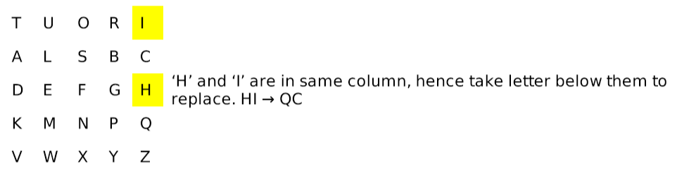

- If both letters are in the same row, take the letter to the right of each one `goingbacktotheleftifatthefarthestright`

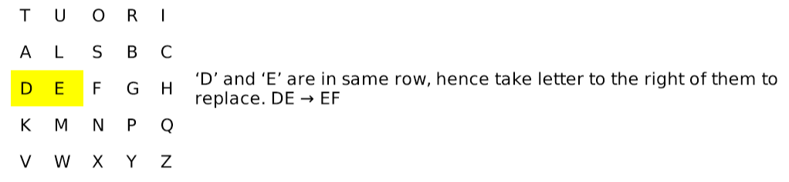

- If neither of the preceding two rules are true, form a rectangle with the two letters and take the letters on the horizontal opposite corner of the rectangle.

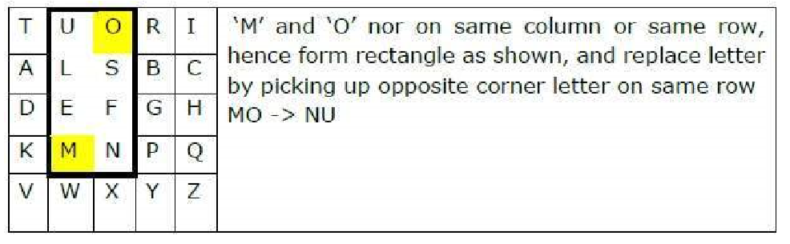

Using these rules, the result of the encryption of ‘hide money’ with the key of ‘tutorials’ would be −

```
QC EF NU MF ZV
```

### Decryption   

Receiver has the same key and can create the same key table, and then decrypt any messages made using that key.

### Security Value

It is also a substitution cipher and is difficult to break compared to the simple substitution cipher. As in case of substitution cipher, cryptanalysis is possible on the Playfair cipher as well, however it would be against 625 possible pairs of letters 25x25 alphabets instead of 26 different possible alphabets. The Playfair cipher was used mainly to protect important, yet non-critical secrets, as it is quick to use and requires no special equipment.

## [Vigenere Cipher](https://en.wikipedia.org/wiki/Vigen%C3%A8re_cipher)

This scheme of cipher uses a text string say, a word as a key, which is then used for doing a number of shifts on the plaintext.

For example, let’s assume the key is ‘point’. Each alphabet of the key is converted to its respective numeric value:

In this case, p → 16, o → 15, i → 9, n → 14, and t → 20. Thus, the key is: 16 15 9 14 20.

### Process of Vigenere Cipher

- The sender and the receiver decide on a key. Say ‘point’ is the key. Numeric representation of this key is ‘16 15 9 14 20’. The sender wants to encrypt the message, say ‘attack from south east’. He will arrange plaintext and numeric key as follows −

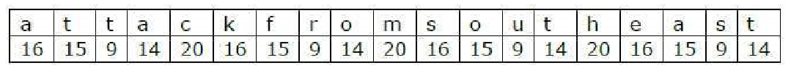


- He now shifts each plaintext alphabet by the number written below it to create cipher text as shown below −

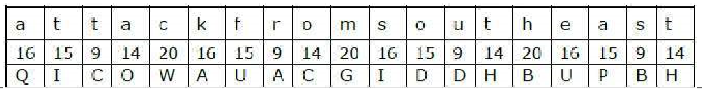

- Here, each plaintext character has been shifted by a different amount – and that amount is determined by the key. The key must be less than or equal to the size of the message.

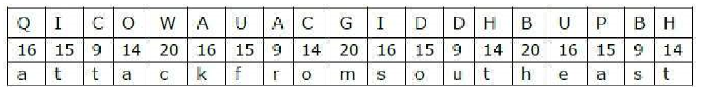

### Decryption

The receiver uses the same key and shifts received cipher text in reverse order to obtain the plaintext.

### Security Value

Vigenere Cipher was designed by tweaking the standard Caesar cipher to reduce the effectiveness of cryptanalysis on the cipher text and make a cryptosystem more robust. It is significantly more secure than a regular Caesar Cipher. In the history, it was regularly used for protecting sensitive political and military information. It was referred to as the unbreakable cipher due to the difficulty it posed to the cryptanalysis. Variants of Vigenere Cipher There are two special cases of Vigenere cipher − The keyword length is same as plaintect message. This case is called Vernam Cipher. It is more secure than typical Vigenere cipher. Vigenere cipher becomes a cryptosystem with perfect secrecy, which is called One-time pad.

## [Pseudo-Random Number Generators](https://en.wikipedia.org/wiki/Pseudorandom_number_generator) -

We can visualize a random sequence by drawing a path that changes direction according to each number, known as a random walk. At each point in the sequence the next move is always unpredictable. Random processes are said to be nondeterministic, since they are impossible to determine in advance. Machines, on the other hand, are deterministic. Their operation is predictable and repeatable. Von Neumann developed an algorithm to mechanically simulate the scrambling aspect of randomness as follows:
- First, select a truly random number, called the `seed`. This number could come from the measurement of noise, or the current time in milliseconds.
- Next, this seed is provided as input to a simple calculation. Multiply the seed by itself, and then output the middle of this result.
- Then you use this output as the next seed, and repeat the process as many times as needed. This is known as the middle-squares method and is just the first in a long line of pseudorandom number generators. <br>

The randomness of the sequence is dependent on the randomness of the initial seed only. Same seed gives the same sequence. So, what are the differences between a randomly generated versus pseudorandomly generated sequence?

Let's represent each sequence as a random walk. They seem similar until we speed things up. The pseudorandom sequence must eventually repeat. This occurs when the algorithm reaches a seed it has previously used, and the cycle repeats. The length, before a pseudorandom sequence repeats, is called `the period`.

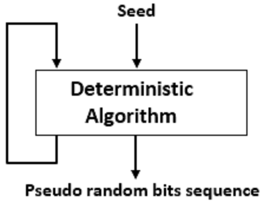

### Limitations

- The period is strictly limited by the length of the initial seed. For example, if we use a two-digit seed, then an algorithm can produce, at most, 100 numbers, before reusing a seed and repeating the cycle. A three-digit seed can't expand past 1,000 numbers before repeating its cycle, and a four-digit seed can't expand past 10,000 numbers before repeating. Though if we use a seed large enough, the sequence can expand into trillions and trillions of digits before repeating. <br>

- Though the key difference is important. When you generate numbers pseudorandomly, there are many sequences which cannot occur. <br>

### Advantages

- For a pseudorandom sequence to be indistinguishable from a randomly generated sequence, it must be impractical for a computer to try all seeds and look for a match.

- With pseudorandom generators, the security increases as the length of the seed increases. Pseudorandomness frees Alice and Bob from having to share their entire random shift sequence in advance. Instead, they share a relatively short random seed, and expand it into the same random-looking sequence when needed.

## [One-Time Pad Cipher](https://en.wikipedia.org/wiki/One-time_pad) -

How to design a cipher that hides fingerprints, thus stopping the leak of information? The answer was randomness.
Imagine Alice rolled a 26 sided die to generate a long list of random shifts, and shared this with Bob instead of a code word. Now, to encrypt her message, Alice uses the list of random shifts instead. It is important that this list of shifts be as long as the message, as to avoid any repetition. Then she sends it to Bob, who decrypts the message using the same list of random shifts she had given him.

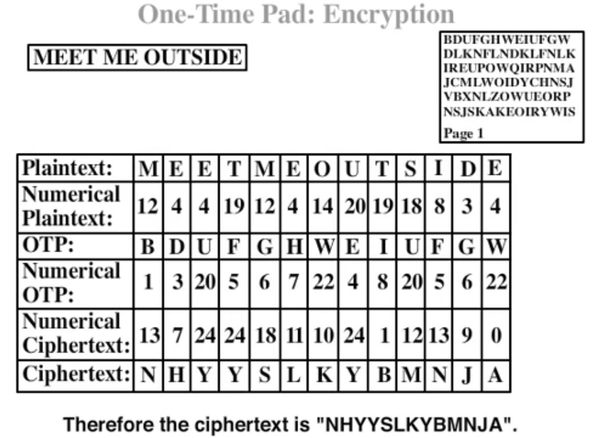

### Advantages

- The shifts never fall into a repetitive pattern.
- The encrypted message will have a uniform frequency distribution. Because there is no frequency differential and therefore no leak

***Note*** : This can be analogous to a Polyalphabetic Cipher with the Key Word of length equal to the message length.

## [Transposition Cipher](https://en.wikipedia.org/wiki/Transposition_cipher)

It is another type of cipher where the order of the alphabets in the plaintext is rearranged to create the cipher text. The actual plaintext alphabets are not replaced.

### Rail Fence Cipher

The Rail Fence cipher is a form of transposition cipher that gets its name from the way in which it is encoded. In the rail fence cipher, the plaintext is written downwards on successive "rails" of an imaginary fence, then moving up when we get to the bottom. The message is then read off in rows. For example, using three "rails" and a message of 'WE ARE DISCOVERED. FLEE AT ONCE', the Cipherer writes out:

```
W . . . E . . . C . . . R . . . L . . . T . . . E
. E . R . D . S . O . E . E . F . E . A . O . C .
. . A . . . I . . . V . . . D . . . E . . . N . .
```

Then reads off:

```
WECRL TEERD SOEEF EAOCA IVDEN
```

The Cipherer has broken this cipher text up into blocks of five to help avoid errors. This is a common technique used to make the cipher more easily readable. The spacing is not related to spaces in the plaintext and so does not carry any information about the plain text.

### Route Cipher

In a route cipher, the plaintext is first written out in a grid of given dimensions, then read off in a pattern given in the key. For example, using the same plaintext that we used for rail fence:

```
W R I O R F E O E
E E S V E L A N J
A D C E D E T C X
```

The key might specify "spiral inwards, clockwise, starting from the top right". That would give a cipher text of:

```
EJXCTEDECDAEWRIORFEONALEVSE
```

Route ciphers have many more keys than a rail fence. In fact, for messages of reasonable length, the number of possible keys is potentially too great to be enumerated even by modern machinery. However, not all keys are equally good. Badly chosen routes will leave excessive chunks of plaintext, or text simply reversed, and this will give cryptanalysts a clue as to the routes.

**Note** : A variation of the route cipher was the `Union Route Cipher`, used by Union forces during the American Civil War. This worked much like an ordinary route cipher, but transposed whole words instead of individual letters. Because this would leave certain highly sensitive words exposed, such words would first be concealed by code. The cipher clerk may also add entire null words, which were often chosen to make the cipher text humorous.

### Columnar Transposition

In a columnar transposition, the message is written out in rows of a fixed length, and then read out again column by column, and the columns are chosen in some scrambled order. Both the width of the rows and the permutation of the columns are usually defined by a keyword.

For example, the keyword ZEBRAS is of length 6 (so the rows are of length 6), and the permutation is defined by the alphabetical order of the letters in the keyword. In this case, the order would be "6 3 2 4 1 5".

In a regular columnar transposition cipher, any spare spaces are filled with nulls; in an irregular columnar transposition cipher, the spaces are left blank. Finally, the message is read off in columns, in the order specified by the keyword.

For example, suppose we use the keyword ZEBRAS and the message WE ARE DISCOVERED. FLEE AT ONCE. In a regular columnar transposition, we write this into the grid as follows:

```
6 3 2 4 1 5
W E A R E D
I S C O V E
R E D F L E
E A T O N C
E Q K J E U
```

providing five nulls (QKJEU), these letters can be randomly selected as they just fill out the incomplete columns and are not part of the message. The cipher text is then read off as:

```
EVLNE ACDTK ESEAQ ROFOJ DEECU WIREE
```

In the irregular case, the columns are not completed by nulls:

```
6 3 2 4 1 5
W E A R E D
I S C O V E
R E D F L E
E A T O N C
E
```

This results in the following cipher text:

```
EVLNA CDTES EAROF ODEEC WIREE
```

### Decryption

The recipient has to work out the column lengths by dividing the message length by the key length. Then he can write the message out in columns again, then re-order the columns by reforming the key word.

**Note** : In a variation, the message is blocked into segments that are the key length long and to each segment the same permutation (given by the key) is applied. This is equivalent to a columnar transposition where the read-out is by rows instead of columns.

### Double Transposition

A single columnar transposition could be attacked by guessing possible column lengths, writing the message out in its columns (but in the wrong order, as the key is not yet known), and then looking for possible anagrams. Thus to make it stronger, a double transposition was often used. This is simply a columnar transposition applied twice. The same key can be used for both transpositions, or two different keys can be used.

For example, we can take the result of the irregular columnar transposition in the previous section, and perform a second encryption with a different keyword, STRIPE , which gives the permutation "564231":

```
5 6 4 2 3 1
E V L N A C
D T E S E A
R O F O D E
E C W I R E
E
```

As before, this is read off columnwise to give the cipher text:

```
CAEEN SOIAE DRLEF WEDRE EVTOC
```

If multiple messages of exactly the same length are encrypted using the same keys, they can be anagrammed simultaneously. This can lead to both recovery of the messages, and to recovery of the keys (so that every other message sent with those keys can be read).

### Myszkowski Transposition

A variant form of columnar transposition, proposed by Émile Victor Théodore Myszkowski , requires a keyword with recurrent letters. In usual practice, subsequent occurrences of a keyword letter are treated as if the next letter in alphabetical order, e.g., the keyword TOMATO yields a numeric keystring of "532164."

In Myszkowski transposition, recurrent keyword letters are numbered identically, TOMATO yielding a keystring of "432143."

```
4 3 2 1 4 3
W E A R E D
I S C O V E
R E D F L E
E A T O N C
E
```

Plaintext columns with unique numbers are transcribed downward; those with recurring numbers are transcribed left to right:

```
ROFOA CDTED SEEEA CWEIV RLENE
```

## [Polybius Square](https://en.wikipedia.org/wiki/Polybius_square) -

### [ADFGVX Cipher](https://en.wikipedia.org/wiki/ADFGVX_cipher)

The cipher is based on the 6 letters ADFGVX. In the following example the alphabet is coded with the Dutch codeword 'nachtbommenwerper'.

This results in the alphabet: `NACHTBOMEWRPDFGIJKLQSUVXYZ`.

This creates the table below with the letters ADFGVX as column headings and row identifiers:

```
  A	D	F	G	V	X
A	N	A	1	C	3	H
D	8	T	B	2	O	M
F	E	5	W	R	P	D
G	4	F	6	G	7	I
V	9	J	0	K	L	Q
X	S	U	V	X	Y	Z
```
The text 'attack at 1200am' translates to this:

```
A	  T	  T	  A 	C	  K 	A	  T	  1	  2	  0	  0	  A	  M
AD	DD	DD	AD	AG	VG	AD	DD	AF	DG	VF	VF	AD	DX
```

Then, a new table is created with a key as a heading. Let's use 'PRIVACY' as a key. Usually much longer keys or even phrases were used.

```
P	R	I	V	A	C	Y
A	D	D	D	D	D	A
D	A	G	V	G	A	D
D	D	A	F	D	G	V
F	V	F	A	D	D	X
```
The columns are sorted alphabetically, based on the keyword, and the table changes to this:

```
A	C	I	P	R	V	Y
D	D	D	A	D	D	A
G	A	G	D	A	V	D
D	G	A	D	D	F	V
D	D	F	F	V	A	X
```

Then, appending the columns to each other results in this cipher text:

```
DGDD DAGD DGAF ADDF DADV DVFA ADVX
```

With the keyword, the columns can be reconstructed and placed in the correct order. When using the original table containing the secret alphabet, the text can be deciphered.

### [Bifid cipher](https://en.wikipedia.org/wiki/Bifid_cipher)

First, a mixed alphabet Polybius square is drawn up, where the I and the J share their position:

```
  1 2 3 4 5
1 B G W K Z
2 Q P N D S
3 I O A X E
4 F C L U M
5 T H Y V R
```

The message is converted to its coordinates in the usual manner, but they are written vertically beneath:

```
F L E E A T O N C E
4 4 3 3 3 5 3 2 4 3
1 3 5 5 3 1 2 3 2 5
```

They are then read out in rows:

```
4 4 3 3 3 5 3 2 4 3 1 3 5 5 3 1 2 3 2 5
```

Then divided up into pairs again, and the pairs turned back into letters using the square:

```
44 33 35 32 43 13 55 31 23 25
U  A  E  O  L  W  R  I  N  S
```

In this way, each cipher text character depends on two plaintext characters, so the bifid is a Digraphic cipher, like the Playfair cipher. To decrypt, the procedure is simply reversed.

Longer messages are first broken up into blocks of fixed length, called `the period`, and the above encryption procedure is applied to each block. One way to detect the period uses bigram statistics on cipher text letters separated by half the period.
- For even periods, p, cipher text letters at a distance of p/2 are influenced by two plaintext letters;
- For odd periods, p, cipher text letters at distances of p/2 (rounded either up or down) are influenced by three plaintext letters.

Thus, odd periods are more secure than even against this form of cryptanalysis, because it would require more text to find a statistical anomaly in trigram plaintext statistics than bigram plaintext statistics.

### [Nihilist cipher](https://en.wikipedia.org/wiki/Nihilist_cipher)

First the cipherer constructs a Polybius square using a mixed alphabet. This is used to convert both the plaintext and a keyword to a series of two digit numbers. These numbers are then added together in the normal way to get the cipher text, with the key numbers repeated as required.

For Example, Consider the Polybius square created using the keyword ZEBRAS:

```
 	1	2	3	4	5
1	Z	E	B	R	A
2	S	C	D	F	G
3	H	I	K	L	M
4	N	O	P	Q	T
5	U	V	W	X	Y
```

with a plaintext of "DYNAMITE WINTER PALACE" and a key of RUSSIAN. This expands to:

```
PT:  23  55   41  15  35  32  45  12  53   32  41  45  12  14  43  15  34  15  22  12
KEY: 14  51   21  21  32  15  41  14  51   21  21  32  15  41  14  51  21  21  32  15
CT:  37  106  62  36  67  47  86  26  104  53  62  77  27  55  57  66  55  36  54  27
```

### [Tap code](https://en.wikipedia.org/wiki/Tap_code)

The tap code, sometimes called the knock code, is a way to encode text messages on a letter-by-letter basis in a very simple way. The message is transmitted using a series of tap sounds, hence its name.

The tap code is based on a Polybius square using a 5×5 grid of letters representing all the letters of the Latin alphabet, except for K, which is represented by C.

The listener only needs to discriminate the timing of the taps to isolate letters. Each letter is communicated by tapping two numbers:

- The first designating the row (Down)
- The second designating the column (Side to Side)

For example, to specify the letter "B", one taps once, pauses, and then taps twice.

Or to communicate the word "water", the cipher would be the following (the pause between each number in a pair is smaller than the pause between letters):

```
W	A	T	E	R
5, 2
1, 1
4, 4
1, 5
4, 2
····· ··
· ·
···· ····
· ·····
···· ··
```

The letter "X" is used to break up sentences, and "K" for acknowledgements.

Because of the difficulty and length of time required for specifying a single letter, prisoners often devise abbreviations and acronyms for common items or phrases, such as "GN" for Good night, or "GBU" for God bless you.

By comparison, `Morse code` is harder to send by tapping or banging because it requires the ability to create two differently sounding taps (representing the dits and dahs of Morse code). A Morse code novice would also need to keep a "cheat sheet" until he or she remembers every letter's code, which the captors would likely confiscate. Tap code can be more easily decoded in one's head by mentally using the table. For example, if you hear four knocks, you would think A… F… L… Q as the count increased; then after the pause, you hear three knocks and think Q… R… to arrive at the letter "S".

### [Trifid Cipher](https://en.wikipedia.org/wiki/Trifid_cipher)

The cipher requires a 27-letter mixed alphabet: we follow Delastelle by using a plus sign as the 27th letter. A traditional method for constructing a mixed alphabet from a key word or phrase is to write out the unique letters of the key in order, followed by the remaining letters of the alphabet in the usual order.

For example, the key FELIX MARIE DELASTELLE yields the mixed alphabet FELIXMARDSTBCGHJKNOPQUVWYZ+.

To each letter in the mixed alphabet we assign one of the 27 trigrams (111, 112, …, 333) by populating a 3 × 3 × 3 cube with the letters of the mixed alphabet, and using the Cartesian coordinates of each letter as the corresponding trigram.

```
     Layer 1		         Layer 2		         Layer 3

     1	2	3			 1	2	3			 1	2	3
1	F	E	L		1	S	T	B		1	O	P	Q
2	I	X	M		2	C	G	H		2	U	V	W
3	A	R	D		3	J	K	N		3	Y	Z	+
```

From this cube we build tables for enciphering letters as trigrams and deciphering trigrams as letters:

```
    Enciphering alphabet		           Deciphering alphabet
A = 131	J = 231	S = 211		111 = F	211 = S	311 = O
B = 213	K = 232	T = 212		112 = E	212 = T	312 = P
C = 221	L = 113	U = 321		113 = L	213 = B	313 = Q
D = 133	M = 123	V = 322		121 = I	221 = C	321 = U
E = 112	N = 233	W = 323		122 = X	222 = G	322 = V
F = 111	O = 311	X = 122		123 = M	223 = H	323 = W
G = 222	P = 312	Y = 331		131 = A	231 = J	331 = Y
H = 223	Q = 313	Z = 332		132 = R	232 = K	332 = Z
I = 121	R = 132	+ = 333		133 = D	233 = N	333 = +
```

The encryption protocol divides the plaintext into groups of fixed size (plus possibly one short group at the end): this confines encoding errors to the group in which they occur, an important consideration for ciphers that must be implemented by hand. The group size should be coprime to 3 to get the maximum amount of diffusion within each group: Delastelle gives examples with groups of 5 and 7 letters. He describes the encryption step as follows:

We start by writing vertically under each letter, the numerical trigram that corresponds to it in the enciphering alphabet: then proceeding horizontally as if the numbers were written on a single line, we take groups of three numbers, look them up in the deciphering alphabet, and write the result under each column.

For example, if the message is aide-toi, le ciel t'aidera, and the group size is 5, then encryption proceeds as follows:

```
a i d e-t   o i l e c   i e l t'a   i d e r a
1 1 1.1 2   3 1 1.1 2   1 1 1.2 1   1 1 1.1 1
3.2 3 1.1   1.2 1 1.2   2.1 1 1.3   2.3 1 3.3
1 1.3 2 2   1 1.3 2 1   1 2.3 2 1   1 3.2 2 1
F M J F V   O I S S U   F T F P U   F E Q Q C
```

In this table the periods delimit the trigrams as they are read horizontally in each group, thus in the first group we have 111 = F, 123 = M, 231 = J, and so on.

## Difference between Ciphers and Codes

`Cipher`: A cipher changes a message on a letter-by-letter basis.<br><br>
`Code`: a code converts whole plaintext words or phrases into other words or numbers.

Usually, the code is a 4 or 5 digit number and the sender and receiver must have a code book with thousands or up to tens of thousands of codes. Early code books would list the codes in numerical order and the words or phrases were also listed alphabetically.

So the code book was like a `dictionary` with the words listed alphabetically and the numbers sequentially. This allowed for a single code book to be used to encipher or decipher a message. Words starting with “A” had low code numbers and words starting with “Z” had high code numbers. But this was a serious design flaw which gave the cryptanalyst clues in decoding the message by using the relative position of known words from other decoded messages.

Later code books would be divided in two sections, one listing the codes in numeric order and the other section listing the words or phrases in alphabetic order. This made for a stronger code but also made the book larger and more cumbersome to use.

A code can provide a strong cipher, but if a code book is lost or stolen, then decipherment of all communications is compromised until a new code book is created. Designing and distributing a new code book is extremely time consuming and dangerous. Also, messages that remained secret for years can now be decrypted, yielding valuable intelligence even though the information is dated. Because of this exposure to compromise, code books were often used for diplomats or spies, which limits the number of books distributed.


# Bibliography
- [Wikipedia](https://www.wikipedia.org/).
- [Khan Academy](https://www.khanacademy.org/computing/computer-science/cryptography/crypt/v/intro-to-cryptography).
- [Traditional Ciphers](https://www.tutorialspoint.com/cryptography/pdf/traditional_ciphers.pdf).

[ ]( https://github.com/shashank3199 )

